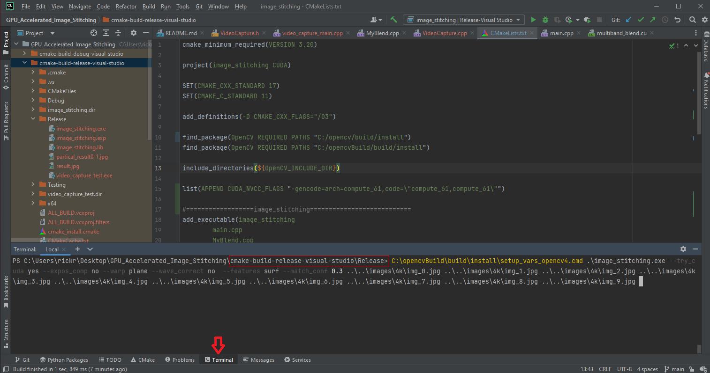
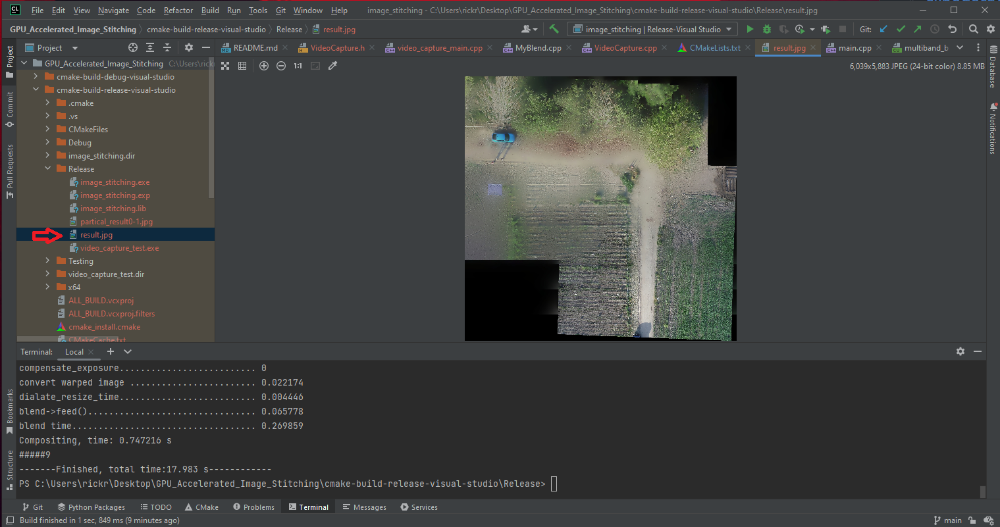

# GPU_Accelerated_Image_Stitching

## CLion Setup
-CLion version 2022.1.3

After cloning the repo, you should be presented with an 'Open Project Wizard'. Select '+' to 
add a new release profile. From the dropdown menus select:
* Toolchain
  * Visual Studio
* Generator
  * Visual Studio 16 2019
  
'-G "Visual Studio 16 2019"' should populate in the CMake options box.

Be sure to select the same options for both Debug and Release.

After selecting 'OK', CMake should start compiling CMakeLists.txt. You might be presented with the 
following error:

To address this, open CMakeLists.txt from the project panel to the left and update find_package() with the 
location of your OpenCV installation folder. ex: "C:/opencvBuild/build/install". Delete or comment out the remaining
find_package() options and select 'Reload changes' on the top right of the text editor. 

CMake should recompile without error. If it does not, navigate to the CMake option under the tools tab and 
select 'Reset Cache and Reload Project'. You can check the progress of compilation under the CMake tab at the bottom of the IDE.

From the configurations dropdown menu at the top of the IDE, select 'Release Visual Studio' and press the build
icon to the left (or enter CRTL + F9) to build the project

At the bottom of the IDE, open the terminal tab and navigate the release folder under the 'cmake-build-release-visual-studio'
directory. To run the executable, enter the following:

C:\opencvBuild\build\install\setup_vars_opencv4.cmd .\image_stitching.exe --try_cuda yes --expos_comp no --warp plane --wave_correct no  --features surf --match_conf 0.3 ..\..\images\4k\img_0.jpg ..\..\images\4k\img_1.jpg ..\..\images\4k\img_2.jpg ..\..\images\4k\img_3.jpg ..\..\images\4k\img_4.jpg ..\..\images\4k\img_5.jpg ..\..\images\4k\img_6.jpg ..\..\images\4k\img_7.jpg ..\..\images\4k\img_8.jpg ..\..\images\4k\img_9.jpg_

**Note: The use of C:\opencvBuild\build\install\setup_vars_opencv4.cmd before running the program. Excluding this might cause the ..\..\..\..\
program to execute with no output. 

When the program finishes executing, a composite image should generate in the 'release' folder under 'cmake-build-release-visual-studio'

